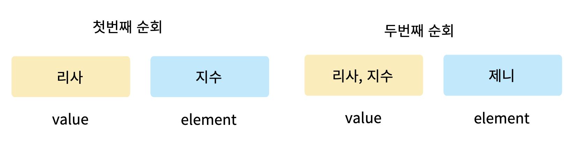

# Dart란?

- UI 제작에 최적화되어있는 언어
- 비동기 언어이며 이벤트 기반임
- 아이솔레이트를 이용한 동시성 기능 제공
- Null safety, Spread Operator, Collection if등 UI를 코딩할 수 았는 기능 제공
  - null safety
    - null에게서 안전한 프로그램 코드 작성하는 것 의미
    - null safety를 사용하면 컴파일러에서 코드 실행 전 버그를 찾아 수정 가능
    - null을 제거하는 것이 아님!!
- javascript의 완전한 컴파일 지원
- 백엔드 프로그래밍 지원

---

# Dart 기본 문법
  
## 1. final / const를 사용한 변수 선언

- final : 런타임 상수
    - 실행을 해봐야 값을 알 수 있음
    - 추후 값을 변경할 수 없음
- const : 빌드타임 상수
    - 빌드타임에 값을 알 수 있어야함
- 코드를 실행하지 않은 상태에서 값이 확정되면 const, 실행될 때 확정되면 final 사용
  

## 2. 컬렉션

- 자유롭게 형변환 가능
- List : 여러 값을 순서대로 저장
    - reduce()
        - 함수가 실행되는 리스트 요소들의 타입이 같아야만 함
    
    - fold()
        - 함수가 실행되는 리스트 요소들의 타입이 같지 않아도 반환 가능
- Map : 특정 키값을 기반으로 빠르게 값을 검색
- Set : 중복된 데이터 제거
  

## 3. 연산자
- null, 수치, 값 비교, 타입 비교, 논리 연산자 존재
- while : 조건 확인 후 반복문 실행
- do..while : 반복문 실행 후 조건 확인
  

## 4. 함수의 일반적 특징
- 함수는 재활용이 가능함
- void : 반환할 값이 없음
- 매개변수를 지정하는 방법
    - positional parameter : 입력된 순서대로 매개변수에 값이 지정
    - named parameter : 순서에 관계없이 지정하고 싶은 매개변수의 이름을 이용해 값 입력 가능하며 키와 값 형태로 매개변수를 입력하면 됨.
- 람다에서는 익명 함수와 람다 함수를 구분하지 않음
    - 식 : `(매개변수) => 단 하나의 스테이트먼트`
    - 람다에서 매개변수는 아예 없거나 하나 이상이어도 됨
    - 콜백, 리스트의 map(), reduce(), fold() 함수 등에서 일회성이 높은 로직을 작성할 때 주로 사용
- typedef : 함수의 시그니처를 정의한는 값으로 함수 선언부를 정의하는 키워드

---

# 객체지향 프로그래밍

- 밀접한 관계가 있는 함수와 변수를 묶어두면 코드 관리가 용이하기에 객제지향 프로그래밍은 상당히 중요한 부분을 차지함
- 클래스를 사용하면 필요한 값들만 입력하도록 제항ㄴ하고 클래스에 특화된 함수를 선언할 수 있음

## 1. Class
- 일종의 설계도
- 데이터가 보유할 속성과 기능을 정의하는 자료구조
- instance : class를 이용해서 객체를 선언하면 해당 객체를 class의 instance라고 부름
- instantiation : class에서 instance를 생성하는 과정

### 1) constructor
- 인스턴스를 생성하는 메서드

### 2) named constructor
- 네임드 파라미터와 상당히 비슷한 개념
- 클래스를 생성하는 여러 방법을 명시하고 싶을 때 사용

### 3) private variable
- 같은 파일에서만 접근 가능한 변수

### 4) Getter / Settter
- Getter : 값을 가져올 때 사용
- Setter : 값을 지정할 때 사용
- 어떤 값을 어떤 형태로 노출할지, 어떤 변수를 변경 가능하게 할 지 정할 수 있음
- 객체지향 프로그래밍에서는 세터를 거의 사용하지 않음
    -> 변수의 값을 Immutable(불변성)한 특성으로 사용하기 때문

### 5) 상속
- 어떤 클래스의 기능을 다른 클래스가 사용할 수 있게 하는 기법
- 부모 클래스 : 기능을 물려주는 클래스
- 자식 클래스 : 물려받는 클래스

### 6) 인터페이스
- 공통으로 필요한 기능을 정의만 해두는 역할
- 상속은 단 하나의 클래스만 가능하지만 인터페이스는 적용 개수에 제한이 없음
- 인터페이스는 반드시 모든 기능을 다시 정의해줘야함