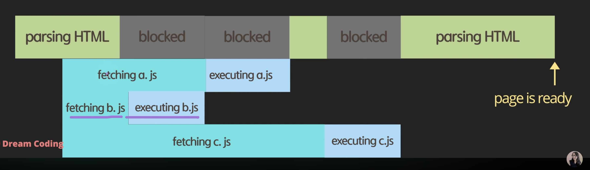
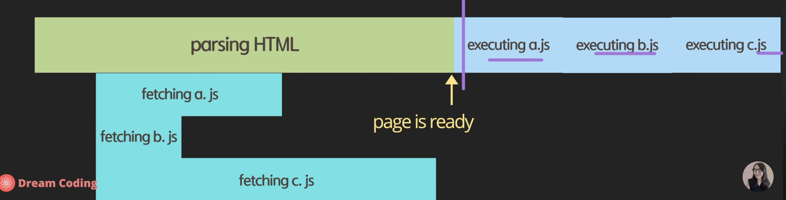

# async vs defer

- HTML에서 JavaScript를 포함할 때 어떻게 포함하는 것이 더 효율적일까?

- 우선 브라우저는 HTML을 한 줄씩 parsing한 것을 css와 결합해서 DOM 요소로 변환됨

1. script를 head에 포함하는 경우

    - HTML 코드를 parsing하는 도중에 js 파일을 읽어옴
    - js 파일의 사이즈가 클 경우 사용자가 웹사이트를 볼 때까지 많은 시간이 소요됨

2. body의 끝부분에 포함하는 경우
    - 브라우저가 HTML을 파싱한 후 script를 실행
    - js가 fetching되기 전에 이미 웹사이트가 준비되어 사용자가 page contents를 볼 수 있음.
    - 그러나 웹사이트가 js에 의존적인 경우라면 사용자가 의미있는 contents를 보기까지 시간이 오래걸림

3. head 안에 async 속성을 이용하여 선언
    - async는 boolean 타입의 속성 -> 선언하는 것만으로도 True로 설정됨
    - 브라우저가 HTML을 parsing 하다가 병렬로 js 파일을 불러옴. 다운로드가 완료되면 parsing하던 파일을 멈추고 contents를 보여줌
    - fetching이 병렬적으로 일어나기 때문에 다운로드 시간을 절약하나 HTML이 parsing되기 전에 js 파일이 실행되는 경우가 생기고 사용자가 페이지를 보는데 시간이 걸릴 수 있음
    - 다수의 스크립트를 다운로드 받을 시, 정의의 순서와는 상관없이 다운로드가 먼저 된 파일을 실행시킴
    

3. head 안에 defer 속성을 이용하여 선언
    - js 파일을 다운받을 것을 명령만 시켜둔 후 HTML 끝까지 parsing 후 js 파일 업로드
    - 가장 좋은 방법
    - 필요한 파일을 다 다운받은 후에 정의한 순서대로 js 파일을 불러옴
    